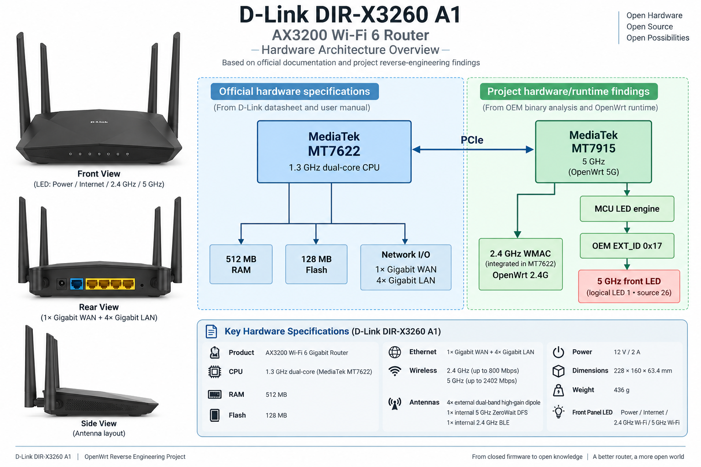

# DIR-X3260 OpenWrt — 深度文章索引



> D-Link DIR-X3260 A1 / MediaTek MT7622 + MT7915 OpenWrt 逆向工程项目

## 设备简介

DIR-X3260 A1 是一台 AX3200 Wi-Fi 6 Gigabit Router。本项目从 OEM firmware、boot/recovery、MT7622 2.4 GHz 初始化问题，一直研究到 MT7915 5 GHz 前面板 LED 的 OEM MCU 控制协议，并最终形成经过实体硬件验证的 OpenWrt Production Final。

### 官方硬件规格

| 项目 | DIR-X3260 A1 |
|---|---|
| 产品 | AX3200 Wi-Fi 6 Gigabit Router |
| CPU | 1.3 GHz dual-core |
| RAM | 512 MB |
| Flash | 128 MB |
| 2.4 GHz 标称速率 | Up to 800 Mbps |
| 5 GHz 标称速率 | Up to 2402 Mbps |
| Ethernet | 1× Gigabit WAN + 4× Gigabit LAN |
| 外置天线 | 4× dual-band high-gain dipole |
| 内置天线 | 1× 5 GHz ZeroWait DFS + 1× 2.4 GHz BLE |
| 前面板 LED | Power / Internet / 2.4 GHz Wi-Fi / 5 GHz Wi-Fi |
| 电源 | 12 V / 2 A |
| 尺寸 | 228 × 160 × 63.4 mm |
| 重量 | 436 g |

> 上表中的 CPU 主频/核心数、RAM、Flash 来自 D-Link 用户手册；接口、无线标称速率、天线、LED、电源、尺寸和重量来自 D-Link A1 datasheet。

### 本项目确认的硬件 / 运行时结构

下面这些内容来自 OEM binary 分析、OpenWrt runtime 和本项目实体设备验证，不应误写成 D-Link datasheet 的公开声明：

```text
D-Link DIR-X3260 A1
        │
        ├── MediaTek MT7622
        │       └── integrated 2.4 GHz WMAC
        │
        └── MediaTek MT7915
                └── 5 GHz radio
                        │
                        └── MCU LED engine
                                │
                                ├── OEM EXT_ID 0x17
                                ├── logical LED index 1
                                └── source 26
                                        │
                                        └── 5 GHz front LED
```

这一区分很重要：**官方产品规格**与**本项目逆向得到的芯片/驱动实现细节**属于两类证据。

---

## 推荐阅读顺序

### 1. MT7622：从 `driver own failed` 找到真正根因

**[DIRX3260_MT7622_ROOT_CAUSE_COMPLETE_ARTICLE_FINAL.md](DIRX3260_MT7622_ROOT_CAUSE_COMPLETE_ARTICLE_FINAL.md)**

主题：

> **DIR-X3260 的 MT7622 Wi-Fi 为什么一直起不来：从 DriverOwn 到 IOC/WPDMA 的完整根因**

主要内容包括 `driver own failed`、MCU timeout、patch semaphore、WBSYS/IOC、WPDMA、DriverOwn/FirmwareOwn，以及为什么 500 ms delay 只是诊断手段。

---

### 2. MT7915：从 GPIO 假设走到 OEM MCU LED protocol

**[DIRX3260_MT7915_LED_REVERSE_ENGINEERING_FINAL.md](DIRX3260_MT7915_LED_REVERSE_ENGINEERING_FINAL.md)**

主题：

> **逆向 D-Link DIR-X3260 OEM 驱动：如何找回 MT7915 5G LED 的 MCU 控制协议**

核心恢复结果：

```text
MAP:
02 05 01 00 00 34 00 00

OFF:
02 01 01 00 00 00 00 00

ON:
02 01 01 01 00 00 00 00
```

文章还记录了 GPIO false lead、OEM Andes MCU path、LuCI disable/enable lifecycle，以及 STAGE55 reboot loop。

---

### 3. 整个项目：从 OEM firmware 到 Production Final

**[DIRX3260_PROJECT_RETROSPECTIVE_FINAL.md](DIRX3260_PROJECT_RETROSPECTIVE_FINAL.md)**

主题：

> **从一台不能正常工作的路由器，到 Production Final：DIR-X3260 OpenWrt 逆向工程全记录**

这是项目总回顾：OEM SHRS、recovery、OpenWrt、MT7622、MT7915 LED、known-good baseline、Internet regression、最终硬件 gate、production freeze、documentation 和 upstream preparation。

---

### 4. Upstream：为什么“我的机器修好了”还不够

**[DIRX3260_UPSTREAM_PATCH_ENGINEERING_FINAL.md](DIRX3260_UPSTREAM_PATCH_ENGINEERING_FINAL.md)**

主题：

> **怎样把一个“只在自己机器上有效”的修复，整理成可以 Upstream 的 Linux/mt76 Patch**

最终 upstream-preparation 分类：

```text
A1   → UPSTREAM CANDIDATE
A2   → HOLD
IOC  → HOLD
A3   → DOWNSTREAM ONLY
B1   → ALREADY UPSTREAM
B2   → SEPARATE REVIEW REQUIRED
```

---

## 与 `docs/` 技术文档的区别

原有文件继续保留在原位置：

```text
docs/
├── Build-Restore-and-Reproduce.md
├── Flash-and-Recovery-Guide.md
├── MT7622-2G-Root-Cause-and-Fix.md
├── MT7915-5G-LED-OEM-Fix.md
├── Reverse-Engineering-Timeline.md
└── articles/
```

`docs/*.md` 更偏向 technical reference、最终证据、刷机/恢复和复现；`docs/articles/*.md` 更偏向长篇阅读、逆向过程、工程推理和项目回顾。

不要为了目录整齐移动原有文档，以免破坏已经发布的 Discussion 或其他相对链接。

---

## Production Final

```text
branch:
dirx3260-production-final

commit:
b6edaaf4e5df8596a742975741428217d24d11e3

tree:
40e472af26dbf5679a45da21f053ca0eccf3ec2a

tag:
dirx3260-production-final-20260906
```

Sysupgrade：

```text
SHA256:
1598fbe2d5c62516abde2fb520e480a721f261e740e6dbf04de15cb8c4a84a71
```

Recovery：

```text
SHA256:
2d63f73def5e90fb5fa84c74965a26231577b3d4d8c6fe00b8d439a7a71d6097
```

---

## 阅读建议

```text
理解 2.4 GHz 根因
    → 第 1 篇

理解 5 GHz LED 逆向
    → 第 2 篇

理解整个项目
    → 第 3 篇

研究 upstream 方法
    → 第 4 篇
```

> **不要让结论走得比证据更远。**

从 OEM binary、寄存器和 MCU command，到实体设备、Production Final，再到 upstream scope review，这条原则贯穿了整个 DIR-X3260 项目。
